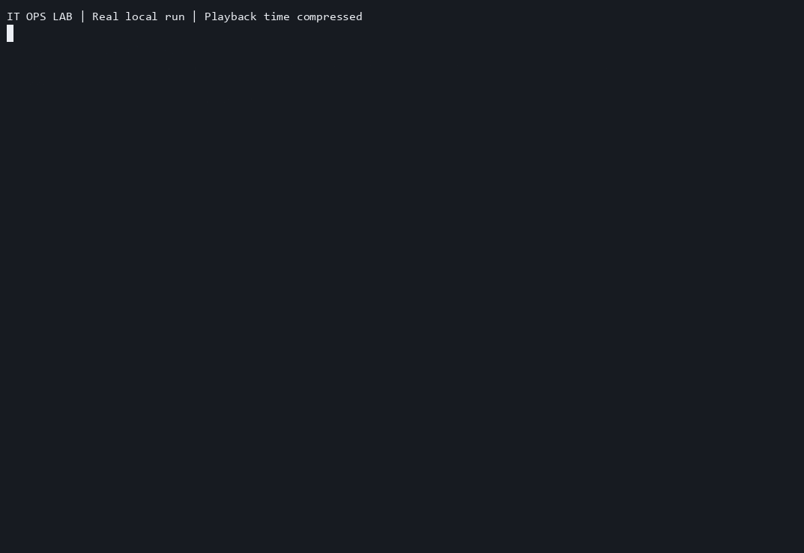
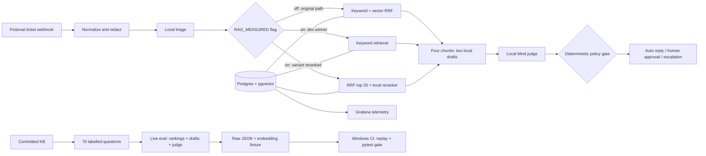
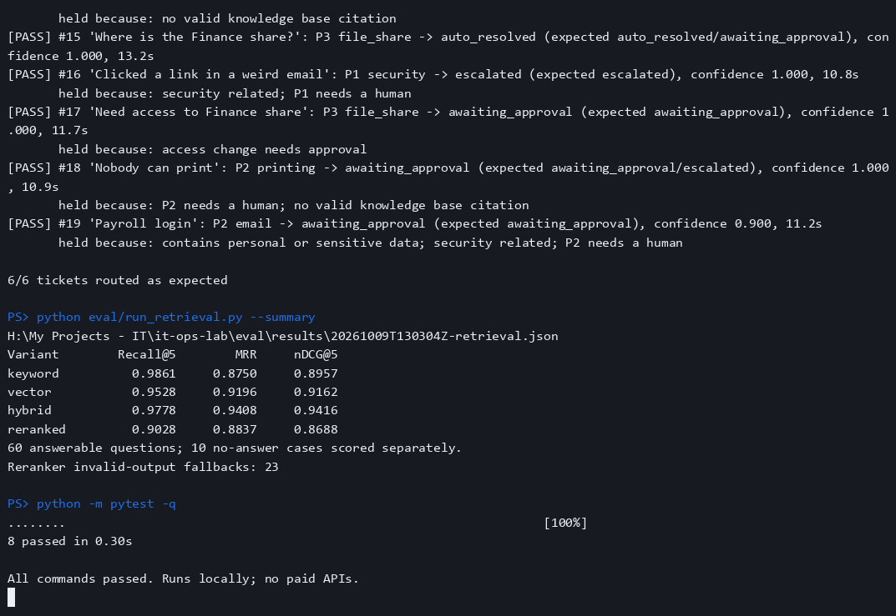
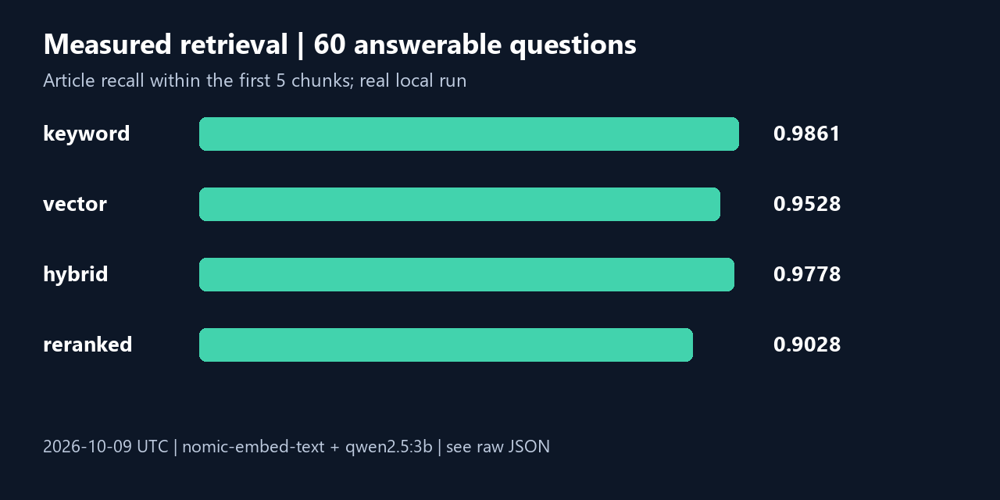
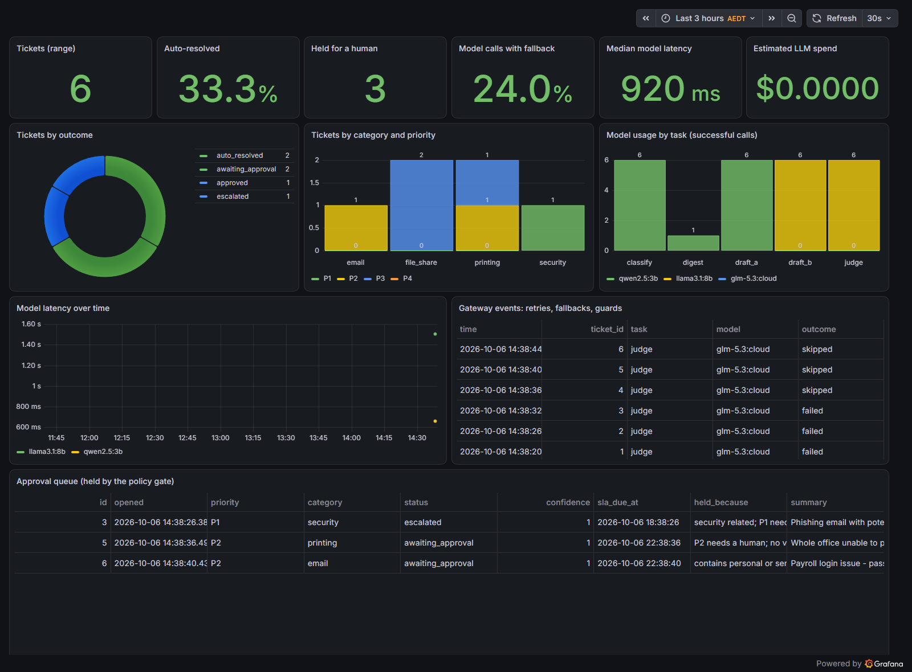

**IT Ops Lab: a local service-desk copilot with measured retrieval, auditable answers and a regression gate.**



[](https://github.com/iamnajib71/it-ops-lab/actions/workflows/eval.yml)
[](LICENSE)


**Runs locally.** The GIF records real n8n ticket processing, cached evaluation and
pytest output; playback is compressed to about a minute. Fictional tickets only.
Docker, Postgres, n8n and local Ollama models provide the complete demo.

## What it shows recruiters

- Evaluation discipline: 70 labelled questions, four retrieval variants, raw per-question evidence, dev/test splits and baseline-derived CI gates.
- AI automation engineering: n8n ticket intake, local retrieval/reranking behind a flag, two drafts, judge review and a deterministic human approval gate.
- Service desk judgement: VPN, shares, print, MFA and onboarding runbooks; P1/P2 escalation, access approval and sensitive-data redaction.

## Architecture



## Screenshots







The dashboard screenshot is from the original lab and includes historical cloud
fallback telemetry. The current judge route and evaluations use local models only.

## Quick start (Windows PowerShell)

Prerequisites: Git, Python 3.10+, Docker Desktop running with its Linux engine,
and [Ollama](https://ollama.com) running. Allow disk space for three local models.
Ports 55432, 5678 and 13000 must be available.

```powershell
git clone https://github.com/iamnajib71/it-ops-lab.git
Set-Location it-ops-lab
python -m venv .venv
.\.venv\Scripts\python.exe -m pip install -r requirements-dev.txt
ollama pull nomic-embed-text
ollama pull qwen2.5:3b
ollama pull llama3.1:8b
.\.venv\Scripts\python.exe scripts/setup_lab.py --measured
.\.venv\Scripts\python.exe tests/run_demo.py
.\.venv\Scripts\python.exe eval/run_retrieval.py
.\.venv\Scripts\python.exe -m pytest -q
```

Setup generates ignored local `.env` credentials, starts digest-pinned images,
applies the schema, embeds the KB, imports the Postgres credential and six
workflows, publishes them and waits for n8n. No credentials are committed.
The demo checks routing, not whether a user's problem was actually fixed.

Open n8n at http://localhost:5678 (create a local owner account for the editor)
and the read-only dashboard at http://localhost:13000. Approvals use a lab shared
token from `.env`; this is a stand-in for SSO, not production identity verification.

### Feature flag and rollback

`--measured` writes `RAG_MEASURED=on` and `RAG_VARIANT=keyword`, the measured dev
winner. Set `RAG_VARIANT=reranked` to exercise RRF plus the local qwen reranker;
`vector` and `hybrid` are also supported. After editing `.env` run
`docker compose up -d n8n`. Set `RAG_MEASURED=off` to restore the old hybrid path.
Invalid reranker output visibly falls back to hybrid; the ticket's judge verdict
records `retrieval_mode` and `rerank_error`. Empty keyword results become an
empty evidence context rather than stopping the workflow.

## Results and evidence

Real local run: 2026-10-09 UTC. Eight articles, 18 chunks,
60 answerable questions plus ten no-answer questions. Recall uses the top five
chunks, deduplicating article IDs. MRR and nDCG are article-based; see the
[full protocol](eval/README.md) for the exact definitions.

| Variant | Recall@5 | MRR | nDCG@5 |
|---|---:|---:|---:|
| Keyword (Postgres) | 0.9861 | 0.8750 | 0.8957 |
| Vector (nomic-embed-text) | 0.9528 | 0.9196 | 0.9162 |
| Hybrid (RRF) | 0.9778 | 0.9408 | 0.9416 |
| Hybrid + local LLM reranker | 0.9028 | 0.8837 | 0.8688 |


The table describes all 60 answerable questions. Selection uses the 40 dev
questions only: dev recall@5, then MRR, then nDCG, with ties favouring simpler
variants. Keyword wins dev recall@5 (0.9792); hybrid has better
MRR. The held-out 20-question recall@5 is keyword 1.0000,
vector 0.9750, hybrid 1.0000, reranked 0.9250.

**The reranker did not help.** It reduced coverage and first-hit ranking, and
23/70 calls produced invalid ID permutations and used hybrid fallback.
The feature flag exposes it for inspection, but the measured configuration
selects keyword rather than promoting an unsuccessful experiment.

| Answer check (keyword; one local draft) | Measured score |
|---|---:|
| Exact inline citation present (60 answerable) | 0.0500 |
| Cited article in gold set (60 answerable) | 0.6833 |
| Citation tags match retrieved sections (60 answerable) | 0.6000 |
| Local judge faithfulness (60 answerable) | 0.8833 |
| Explicit no-answer abstention (10 questions) | 0.7000 |
| Citation-free abstention (10 questions) | 0.1000 |
| Answered rather than refused (60 answerable) | 0.9000 |
| Judge-rated abstention (10 questions) | 0.7000 |


Answer generation uses local `qwen2.5:3b`; the second-stage judge is local
`llama3.1:8b`. Citations are checked before judging. Judge scores are model
opinions, not human-certified correctness. This controlled single-draft experiment
is separate from production's two-draft arbitration and policy gate.

Raw evidence: [retrieval report](eval/results/20261009T125904Z-retrieval.json),
[answer report](eval/results/20261009T125908Z-answers.json), [all historical reports](eval/results),
[cached embeddings and raw model responses](eval/fixtures),
[original hybrid demo output](docs/demo-hybrid.txt),
[clean-clone verification](docs/verification.md),
[real reranker webhook responses](eval/results/20261009T132128Z-reranker-integration.json).
Reports preserve commit hashes, dirty-tree status, input hashes, model digests and
UTC dates. Initial measurements were made on the identified dirty working tree;
their exact inputs and raw responses are retained. Capture resumes identical
model inputs and preserves capture history.

### Regression gate and re-run

Dev baseline: keyword recall@5 0.9792, no-answer abstention
0.7143. CI fails below recall@5 **0.9592** or
abstention **0.7143**. The recall allowance is two percentage
points; abstention permits no lost dev refusals. Thresholds and source reports
are committed in [baseline.json](eval/baseline.json).

```powershell
# Fast offline replay; no Docker or model downloads required
.\.venv\Scripts\python.exe eval/run_retrieval.py
.\.venv\Scripts\python.exe eval/run_answers.py --variant keyword
.\.venv\Scripts\python.exe -m pytest -q

# Live measurements against the local lab
.\.venv\Scripts\python.exe eval/run_retrieval.py --live
.\.venv\Scripts\python.exe eval/verify_sql.py
.\.venv\Scripts\python.exe eval/run_answers.py --live --variant keyword
# For a different candidate: --variant hybrid or --variant reranked
```

CI recomputes vector cosine, RRF, retrieval metrics and answer checks from real
cached fixtures. It also verifies generated workflow exports and runs unit tests.
Cached Postgres ranks and LLM responses do not measure SQL or model drift; input
hash changes fail until fixtures are deliberately refreshed. `verify_sql.py`
checked all 70 hybrid rankings against production SQL successfully.

### What I learned

- More model calls did not make retrieval better. Validation caught malformed
  rankings, but even valid reranking reduced recall on this small KB.
- The winner depends on the stated objective: keyword covers more gold articles,
  while hybrid puts relevant evidence first more often. I kept that tradeoff visible.
- Citation membership is a useful cheap check, but groundedness and refusal need
  separate measurements; neither a citation nor an LLM judge proves correctness.
  For example, the judge accepted q003's extra connectivity advice as helpful
  despite the question already stating that the handshake works. Manual review
  remains necessary. Refusals with unrelated citation metadata are also exposed
  by the separate citation-free abstention score.

## Project structure

```text
kb/                         Eight committed support articles
db/init.sql                 pgvector, keyword/RRF retrieval, tickets and telemetry
scripts/ingest_kb.py         Section chunks + local nomic embeddings
scripts/build_workflows.py  Reviewable prompts, SQL, routing and policy gate
scripts/setup_lab.py        Reproducible local setup without committed secrets
workflows/                  Six generated n8n exports
eval/questions.jsonl        70 labelled questions and gold answers
eval/prompts/               Committed reranker and judge prompts
eval/run_retrieval.py        Four-way live capture or cached replay
eval/run_answers.py          Citation checks, local drafts and local judge
eval/fixtures/               Real embeddings, rankings, drafts and judge outputs
eval/results/                Timestamped raw evidence and provenance
eval/baseline.json           Dev-derived regression thresholds
tests/                      Unit/regression suite and six-ticket live demo
grafana/                    Provisioned dashboard and datasource
docs/                       Real demo GIF, evidence images and logs
```

## Honest limits

This is a synthetic, authored evaluation of a tiny KB, not production ticket
performance. Labels have no independent human adjudication, and related questions
are dependent. The dev/test split limits configuration selection but does not
make this a blinded benchmark. Article-level recall can miss a wrong section;
the gate checks recall@5 while drafting uses four chunks. Abstention uses ten
negatives (seven dev), so estimates are coarse. The local judge shares a model
family with one production drafter and has not been calibrated against humans.

Security, access changes, P1/P2 and sensitive data always go to a person. Auto
resolved means a reply was sent, not that an incident was fixed. SLA targets
are simplified to clock hours. Approval names are self-reported. This is a local
lab with synthetic data; it needs authentication, audit and operational hardening
before real use. The office infrastructure is documented in the companion
[IT Support Homelab](https://github.com/iamnajib71/it-support-homelab).

## Built by Nazmul Hassan

[LinkedIn](https://www.linkedin.com/in/iamnajib71) · [GitHub](https://github.com/iamnajib71)
